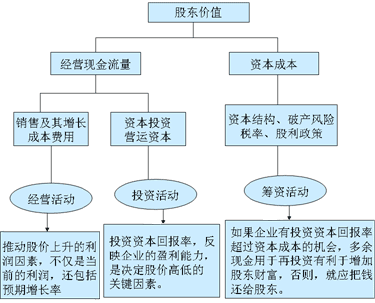

# 前言 1-1
-------------------------------------------
##总论
###目标
财务管理的目标，取决于企业的总目标。企业的目标为生存、发展、获利。

+ （1）	力求保持以收抵支和偿还到期债务的能力，减少破产的风险，长期稳定生存下去，对财务管理的第一个要求。长期亏损，企业终止的内在原因，不能偿还到期债务，直接原因。
+ （2）	筹集企业发展的资金，第二个要求。
+ （3）	通过合理、有效的使用资金使企业获利，第三个要求。企业最具综合能力的目标是盈利。盈利不但体现了企业的出发点和归宿，而且可以概括其他目标的实现程度，并有助于其他目标的实现

企业的财务目标：
+ （1）	利润最大化（利润总额）。缺点：没有考虑利润的取得时间，没有考虑所获利润和投入资本额的关系，没有考虑获取利润和所承担风险的关系。
+ （2）	每股盈余最大化（每股利润或权益资本净利率）。缺点：没有考虑每股盈余取得的时间，没有考虑每股盈余的风险性。
+ （3）	股东财富最大化（每股股价）。缺点：难以计量。股价的高低，代表了投资大众对公司价值的客观评价。它以每股价格表示，反映了资本与获利之间的关系；它受预期每股盈余的影响，反映了每股盈余大小及取得的时间；它受企业风险大小的影响，可以反映每股盈余的风险。

新：

+ （1）股东财富可以用股东权益的市场价值来衡量。
股东财富增加＝股东权益的市场价值－股东投资资本＝权益的市场增加值
　　权益的市场增加值是企业为股东创造的价值。
+ （2）假设股东投资资本不变，股价最大化与增加股东财富具有同等意义。
如无假设条件，股价最大化与增加股东财富并不具有同等。企业与股东之间的交易也会影响股价，但并不影响股东财富。如，分派股利时股价下跌，回购股票时股价上升等。
+ （3）假设股东投资资本和利息率不变，企业价值最大化与股东财富最大化具有相同的意义。
如无假设条件，不能简单地将企业价值最大化等同于股东财富最大化。因为企业价值增加＝权益价值增加+债务价值增加，而债务价值的变化是由市场利率变化引起。即利率不变，债务增加值＝0。
---
###	影响财务管理目标实现的因素。
新编：

股东价值的创造，是由企业长期的现金创造能力决定的。

创造现金的最基本途径，一是提高经营现金流量，二是降低资本成本。

三个结论：
+ 1、经营活动：取决于销售收入和成本费用两个因素。结论：推动股价上升的利润因素，不仅是当前的利润，还包括预期增长率。
+ 2、投资活动：包括资本资产投资和营运资产投资。结论：投资资本回报率反映了企业的盈利能力，是决定股价高低的关键因素。
+ 3、筹资活动：结论：如果企业有投资资本回报率超过资本成本的投资机会，多余现金用于再投资有利于增加股东财富，否则就应把钱还给股东。

###股东、经营者和债权人利益的冲突和协调
股东的目标：即财务管理的目标（股东财富最大化）

经营者的目标：
+ 增加报酬，增加闲暇时间，避免风险
+ 背离股东目标的表现：道德风险，逆向选择
+ 防止背离的方法：监督，激励。最佳的办法是监督成本、激励成本与偏离股东目标的损失之和为最小。

债权人的目标：
+ 获取利息，到期收回本金
+ 防止其利益受伤害的方法：寻求立法保护（破产时优先接管，优先于股东分配剩余财产），借款合同限制性条款（规定资金用途，规定不得发行新债，限制发行新债的数额），拒绝进一步合作，不再提供新的借款，提前收回借款。
股东、经营者和债权人之间构成了企业最重要的财务关系。

###财务管理的对象：资金的循环和周转
　	      应注意的问题：
          
   内部原因	
+ 盈利企业	
  - 不扩充：现金流转一般比较顺畅
  - 扩 充：现金流转可能会不平衡
- 亏损企业	
  - 长期看：现金流转不可能维持
  - 短期看：
    - 亏损<折旧：在固定资产重置以前，现金流转可以维持
    - 亏损>折旧：不从外部补充现金，现金流转难以维持
	扩充企业	盈利：可能出现现金短缺
亏损：现金严重短缺
外部原因	市场季节性变化、经济波动、通货膨胀、竞争
（1）盈利企业也可能由于抽出过多现金而发生临时流转困难；
　　（2）亏损额小于折旧额的企业，应付日常的现金开支并不困难；
　　营业现金净流量＝营业现金流入－营业现金流出
　　　　　　　　　＝营业收入－付现成本－所得税
　　　　　　　　　＝营业收入－（付现成本+折旧）－所得税+折旧
＝营业收入－营业成本－所得税+折旧
　　　　　　　　　＝营业税后利润+折旧
　　即每期的现金增加是营业税后利润与折旧两者之和，营业利润和现金流量的差异是由非付现费用（折旧，待摊等）引起的。
　　（3）任何要迅速扩大经营规模的企业，都会遇到相当严重的现金短缺问题；
　　（4）通货膨胀造成的现金流转不平衡，不能靠短期借款解决。
【例题】以下关于现金流转的表述中，正确的有（　）。 （2005年）
　　A.任何企业要迅速扩大经营规模，都会遇到现金短缺问题
　　B.亏损额小于折旧额的企业，只要能在固定资产重置时从外部借到现金，就可以维持现有局面（错）。短期看，在固定资产重置以前可以维持下去。（对）
　　C.亏损额大于折旧额的企业，如不能在短期内扭亏为盈，应尽快关闭
　　D.企业可以通过短期借款解决通货膨胀造成的现金流转不平衡问题
　　【答案】AC
　　【解析】任何要迅速扩大经营规模的企业，都会遇到相当严重的现金短缺情况，所以选项A正确；亏损额小于折旧额的企业，在固定资产重置以前可以维持下去，当企业需要重置固定资产时，财务主管的惟一出路就是设法借钱，然而这种方法只能解决一时的问题，它增加了以后年度的现金支出，会进一步增加企业的亏损，所以选项B错误；亏损额大于折旧额的企业，是濒临破产的企业，这类企业不从外部补充现金将很快破产，然而这类企业从外部寻找资金来源是很困难的，所以如不能在短期内扭亏为盈，应尽快关闭，即选项C正确；通货膨胀造成的现金流转不平衡，不能靠短期借款解决，因其不是季节性临时现金短缺，而是现金购买力被永久地“蚕食”了，所以选项D错误。
(五)财务管理的内容：筹资决策、投资’决策和股利决策。
(五)	财务管理的主要职能：决策、计划和控制。
(六)	财务管理的原则：即理财原则，指人们对财务活动的共同的、理性的认识。
财务管理理论包括：假设、概念、原理、原则
财务管理实务包括：原则、程序、方法。
理财原则是理论和实务的结合部分。
特征：（1）是财务假设、概念和原理的推论。
（2）必须符合大量观察和事实，被多数人所接受。
（3）是财务交易和财务决策的基础。
（4）为解决新的问题提供指引。
（5）不一定在任何情况下都绝对正确。
　理财原则的内容：3类12条
1.	有关竞争环境的原则（资本市场中人的行为规律的基本认识）
（1）	自利行为原则：
概念（指人们在进行决策是按照自己的财务利益行事，在其他条件相同的情况下人们会选择对自己经济利益最大的行动）
依据（理性的经济人假设）
应用（委托代理理论、机会成本的概念）
（2）	双方交易原则：
概念（指每一项交易都至少存在两方，在一方根据自己的经济利益决策时，另一方也会按照自己的经济利益决策行动，并且对方和你一样聪明、勤奋和富有创造力，因此你在决策时要正确预见对方的反应。）
依据（至少两方、零和博奕、各方都是自利的）
应用（要求在理解财务交易时不能以我为中心，在谋求自身利益的同时要注意对方的存在，以及对方也在遵循自利行为原则行事；要求在理解财务交易时注意税收的影响）
（3）	信号传递原则：是自利行为原则的延伸。
概念（指行动可以传递信息，并且比公司的声明更有说明力）
应用（要求根据公司的行为判断它未来的收益状况；要求公司在决策时不仅要考虑行动方案本身，还要考虑该项行动可能给人们传达的信息）
（4）	引导原则：是行动传递信号原则的一种运用。
概念（指当所有办法都失败时，寻找一个可以依赖的榜样作为自己的引导）
适用范围（一是理解存在局限性，认识能力有限，找不到最优的解决方案办法；二是寻找最优方案的成本过高）不会找到最优方案，但可避免最差的行动。
应用（行业标准概念；免费跟庄概念）
2.	有关创造价值的原则（人们对增加企业财富基本规律的认识）
（1）	有价值的创意原则
概念（指新创意能获得额外报酬）
应用（直接投资项目、经营和销售活动）
（2）	比较优势原则
概念（指专长能创造价值）
依据（分工理论）
应用（人尽其才，物尽其用；优势互补）
（3）	期权原则（指估价时要考虑期权的价值）
有时一项资产附带的期权比该资产本身更有价值
（4）	净增效益原则
概念（指财务决策建立在净增效益的基础上，一项决策的价值取决于它和替代方案相比所增加的净收益）
应用（差额分析法；沉没成本概念）
一个方案的净收益＝该方案现金流入减去现金流出的差额(现金流量净额)
现金流入和流出都是指该方案引起现金流量的增加额，这些现金流量依存于特定方案，如果不采纳该方案就不会发生这些现金流入和流出。
3.	有关财务交易的原则(人们对财务交易基本规律的认识)
（1）	风险-报酬权衡原则
概念（指风险和报酬之间存在一个对等关系，投资人必须对报酬和风险作出权衡）
现实市场中只有高风险同时高报酬和低风险同时低报酬的投资机会。
（2）	投资分散化原则
概念（指不要把全部财富投资于一个公司，而要分散投资）
依据（投资组合理论－若干中股票组成的投资组合，其收益是这些股票收益的加权平均数，但其风险要小于这些股票的加权平均风险）
（3）	资本市场有效原则
概念（指在资本市场上频繁交易的金融资产的市场价格反映了所有可获得的信息，而且面对新信息完全能迅速地做出调整）
应用（要求理财时重视市场对企业的估价；要求理财时慎重使用金融工具）
如果资本市场是有效的，购买或出售金融工具的交易的净现值就为零。公司作为从资本市场上取得资金的一方，很难通过筹资获得正的净现值（或很难增加股东财富）。在资本市场上，只获得与投资风险相称的报酬，也就是与资本成本相同的报酬，很难增加股东财富。
（4）	货币时间价值原则
概念（指在进行财务计量时要考虑货币时间价值因素）
应用（现值概念；早收晚付观念）
（八）财务管理的环境（法律环境、金融市场环境、经济环境）
金融性资产指现金或有价证券等可以进行金融市场交易的资产
特点：流动性、收益性、风险性。
流动性和收益性成反比，收益性和风险性成正比。
利率＝纯粹利率+通货膨胀附加率+风险附加率
纯粹利率指无通货膨胀、无风险情况下的平均利率。
纯粹利率+通货膨胀附加率=无风险报酬率（近似等于无风险报酬率＝国库券的票面利率）。在无通货膨胀时，国库券的利率可以视为纯粹利率。其高低受平均利润率、资金供求关系、国家调节的影响。
利率最高不能超过平均利润率，最低不能等于零或小于零。
